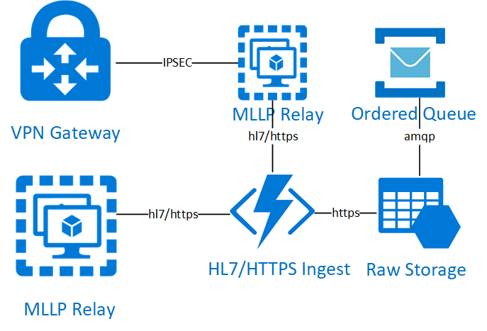
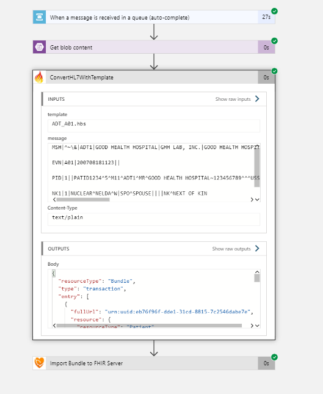

# HL7 Ingest, Conversion and De-Identification Samples
This project contains fully functional sample deployments of ingest, conversion and de-identification workflows powered by Microsoft's FHIR Converter and FHIR Tools for Anonymization. The goal of this project is to provide quick start examples that can be used to accelerate implementation of health data ingest into Azure Health Data Platform.  

The [FHIR Converter](https://github.com/microsoft/FHIR-Converter) is an open source project that enables healthcare organizations to convert legacy data (currently HL7 v2 messages) into FHIR bundles. Converting legacy data to FHIR expands the use cases for health data and enables interoperability.  

[FHIR Tools for Anonymization](https://github.com/microsoft/FHIR-Tools-for-Anonymization) is an open-source project that helps anonymize healthcare FHIR data, on-premises or in the cloud, for secondary usage such as research, public health, and more.

## Overview
This repo provides reference architecture and sample deployments for the ingest and conversion to FHIR of HL7 messages and the de-identification of FHIR resources.
These samples demonstrate incorporating Microsoft's FHIR Converter and FHIR Anonymizer into your enterprise HL7 messaging/FHIR infrastructure to enable end-to-end workflows for a variety of use cases.
The examples include:
  + An HL7 ingest platform to consume HL7 Messages via MLLP and securely Transfer them to Azure via HL7overHTTPS and place in blob storage and produce a consumable event on a high speed ordered service bus for processing.  
  
  + A workflow that performs orderly conversion from HL7 to FHIR via the conversion API and persists the message into a FHIR Server and publishes change events referencing FHIR resources to a high speed event hub to interested subscribers.  
  
  + An event driven De-Identification workflow to support data science activities by de-identified sensitive data and landing it into storage for consumption in analytics activities. 
  

## HL7 Ingest

Infrastructure deployment that will allow you to:
1. Consume MLLP HL7 Messages
2. Securely transfer them to Azure via [HL7overHTTPS](https://hapifhir.github.io/hapi-hl7v2/hapi-hl7overhttp/specification.html)
3. Place in blob storage for audit/errors
4. Produce a consumable event on a high speed ordered service bus for processing



### <a name="ingest"></a>Deploying your own HL7 Ingest Platform
1. [Get or Obtain a valid Azure Subscription](https://azure.microsoft.com/en-us/free/)
2. [Install Azure CLI 2.0 on Linux based System or Windows Bash Shell](https://docs.microsoft.com/en-us/cli/azure/install-azure-cli-apt?view=azure-cli-latest)
3. [Download/Clone this repo](https://github.com/microsoft/health-architectures)
4. Open a bash shell into the Azure CLI 2.0 environment
5. Switch to the HL7Conversion subdirectory of this repo
6. Run the deployhl7ingest.bash script and follow the prompts
7. Send in an hl7 message via HL7 over HTTPS:
    + Locate the sample message medtest.png in the root directory of the repo
    + Use an image viewer to see contents
    + From the linux command shell run the following command to test the hl7overhttps ingest
      ```
        curl --trace-ascii - -H "Content-Type:text/plain" --data-binary @samplemsg.hl7 <your ingest host name from above>/api/hl7ingest?code=<your ingest host key from above>
      ``` 
    + You should receive back an HL7 ACK message
    + Congratulations!!! The sample hl7 message was accepted securely stored into blob storage and queued for further ingest processing on the deployed service bus queue
8. Send in HL7 messages using the local HL7 MLLP Relay. To run a local copy of the HL7 MLLP Relay:
    + Make sure [Docker](https://www.docker.com/) is installed and running in your linux or windows environment
    + From a command prompt run the runhl7relay.bash(linux) or runhl7relay.cmd(windows) passing in the hl7ingest Function App URL (Saved from Above) and the function app access key (Saved from above) as parameters.
        ```
        runhl7relay https://<your ingest host name from above/api/hl7ingest "<function app key from above>"
       ``` 
    + You can now point any HL7 MLLP Engine to the HL7 Relay listening port (default is 8079) and it will transfer messages to the hl7ingest function app over https
    + An appropriate HL7 ACK will be sent to the engine from the relay listener

## HL7toFHIR Conversion

Infrastructure deployment that will create a logic app based workflow that performs orderly conversion from HL7 to FHIR via the [FHIR Converter](https://github.com/microsoft/FHIR-Converter), persists the message into an [Azure API for FHIR Server Instance](https://azure.microsoft.com/en-us/services/azure-api-for-fhir/) and publishes FHIR change events referencing FHIR resources to a high speed event hub to interested subscribers.
Features of the HL7toFHIR Conversion Platform:
  +  Highly Scalable, Secure and Flexible conversion process implementation
  +  FHIR Event Generator and Proxied FHIR Server Access.
  +  Custom Connectors to the FHIR Converter and FHIR Server for easy access to these resources via logic app workflows
  +  Defines a central ingest point and event bus to support virtually unlimited event driven workflow and orchestration scenarios.


### <a name="convert"></a> Deploying your own HL7toFHIR Conversion Workflow
1. [Deploy the HL7 Ingest Platform](#ingest)
2. [Deploy an Azure API for FHIR instance](https://docs.microsoft.com/en-us/azure/healthcare-apis/fhir-paas-portal-quickstart)
3. [Register a Service Client to Access the FHIR Server](https://docs.microsoft.com/en-us/azure/healthcare-apis/register-service-azure-ad-client-app). You will need the following information to configure the HL72FHIR services
   + Client/Application ID for the Service Client
   + The Client Secret for the Service Client
   + The AAD Tenant ID for the FHIR Server/Service Client
   + The Audience/Resource for the FHIR Server/Service Client typically https://azurehealthcareapis.com for Azure API for FHIR
4. [Find the Object Id for the Service Client and Register it with the FHIR Server](https://docs.microsoft.com/en-us/azure/healthcare-apis/find-identity-object-ids)
5. You will need the following information from the HL7 Ingest platform deployment (provided at the end of your deployment):
   + The resource group name created
   + The storage account name created
   + The service bus namespace created
   + The service bus destination queue name created
6. Open a shell or command window into the Azure CLI 2.0 environment
7. Switch to the Managed/HL7Conversion subdirectory of this repo
8. Run the deployhl72fhir.bash script and follow the prompts
9. After successful deployment your converter pipeline is now tied to your ingest platform from above.  To test simply follow the test direction for HL7 Ingest above with the sample HL7 message and you should see resources from the bundle created in the destination FHIR Server
   + You can also see execution from the HL7toFHIR Logic App Run History in the HL7toFHIR resource group.  This will also provide you with detailed steps to see the transform process:



## FHIR De-Identification

Infrastructure deployment that will create an event driven workflow driven by the FHIR Event Hub. This is a real time workflow that de-identifies and redacts sensitive data of FHIR Resources via [FHIR Tools for Anonymization](https://github.com/microsoft/FHIR-Tools-for-Anonymization) and lands them in a de-identified storage account for open consumption in analytics and other non identified data activities


## Deploying your own HL7toFHIR Conversion Workflow
1. [Deploy the HL7toFHIR Conversion Workflow](#convert)
2. Open a shell or command window into the Azure CLI 2.0 environment
3. Switch to the Managed/HL7Conversion subdirectory of this repo
4. Run the deploydeid.bash script and follow the prompts

FHIR® is the registered trademark of HL7 and is used with the permission of HL7
