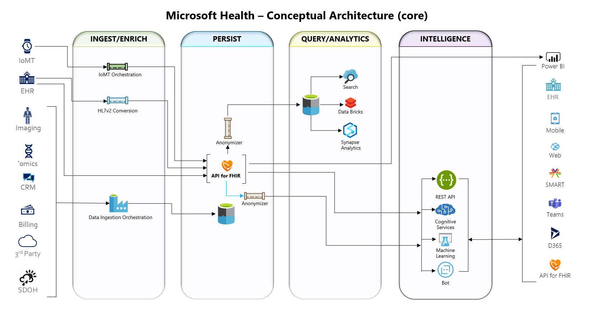

# Introduction 
Health Architectures is a collection of reference architectures and, when appropriate, implementations. They illustrate end-to-end best practices for using the Azure API for FHIR and related technologies. Below is the holistic conceptual end to end architecture for Azure API for FHIR.

For more information on health solutions go to [Azure for Health Cloud.](https://azure.microsoft.com/en-us/industries/healthcare/) For more information regarding the Azure Fast Healthcare Interoperability Resource (FHIR) service for health data solutions go to [Azure API for FHIR.](https://azure.microsoft.com/en-us/services/azure-api-for-fhir/)

We are the Microsoft Health Cloud & Data Architectural Engineering team, which is part of Microsoft Health. We work side by side with the product teams responsible for technologies such as the Azure API for FHIR, IoMT FHIR Connector for Azure, and more. Through collaboration with the product teams, partners and customers we bring you these reference architectures.

As we work with customers, partners, and co-workers, we frequently come across requests for references architectures & code for end to end implementations. For example, how can I pick up HL7v2 messages generated in my environment from my EMR (Electronic Medical Record), Lab System, Scheduling System, etc. then ingest them into FHIR near real-time? These questions and scenarios then become the basis for our reference architectures. Of course, we remove customer specific data, then generalize the design for greater suitability and impact.

As you look through this repository, which will be updated over time, you will see some typical 'hello world' examples as well as more complex solutions. We conduct peer reviews to bring you the best practices for using the Microsoft Health technologies.

We invite you to ask questions, make suggestions and share use cases which we might consider for future reference architectures or implementations.

# Getting Started
We have organized this repo into areas which map to our offering for FHIR and related technologies.

1.  For capabilities central to our FHIR offerings look [here.](http://github.com/microsoft/health-architectures/tree/master/FHIR)  
Topics include:  
    *   How to generate events when create, read, update, or delete (CRUD) operations take place in FHIR
    *   How to export data from FHIR for research, analytics, machine learning, etc.  
    *   How to secure resources in FHIR and/or process data on egress (i.e. anonymization)
2.  For capabilities around our Internet of Medical Things (IoMT) offering look [here.](http://github.com/microsoft/health-architectures/tree/master/IoMT)  
Topics include:  
    *   How to configure the IoMT FHIR Connector and process telemetry data  
    *   How to integrate IoMT data with FHIR and using Microsoft Power BI to create a dashboard  
    *   How to integrate IoMT data with FHIR and using Microsoft Teams to create notifications
3.  For capabilities around ingesting HL7v2 and converting messages to FHIR look [here.](http://github.com/microsoft/health-architectures/tree/master/HL7Conversion)  
Topics include:  
    *   How to ingest HL7v2 from your on-premises system and deliver to Azure for conversion and storage to FHIR   
 

# How to set-up a demonstration environment
We have provided code solutions alongside the reference architectures. While we have tested our code with our OSS & managed FHIR offerings many should be able to deploy against other FHIR deployments (if compliant and at the R4 level).

You can use your existing deployment of our API for FHIR or FHIR Server or you can deploy a sandbox/demo environment by deploying our FHIR server samples as described [here.](http://aka.ms/fhircore)

## Contributing

This project welcomes contributions and suggestions.  Most contributions require you to agree to a
Contributor License Agreement (CLA) declaring that you have the right to, and actually do, grant us
the rights to use your contribution. For details, visit https://cla.opensource.microsoft.com.

When you submit a pull request, a CLA bot will automatically determine whether you need to provide
a CLA and decorate the PR appropriately (e.g., status check, comment). Simply follow the instructions
provided by the bot. You will only need to do this once across all repos using our CLA.

This project has adopted the [Microsoft Open Source Code of Conduct](https://opensource.microsoft.com/codeofconduct/).
For more information see the [Code of Conduct FAQ](https://opensource.microsoft.com/codeofconduct/faq/) or
contact [opencode@microsoft.com](mailto:opencode@microsoft.com) with any additional questions or comments.